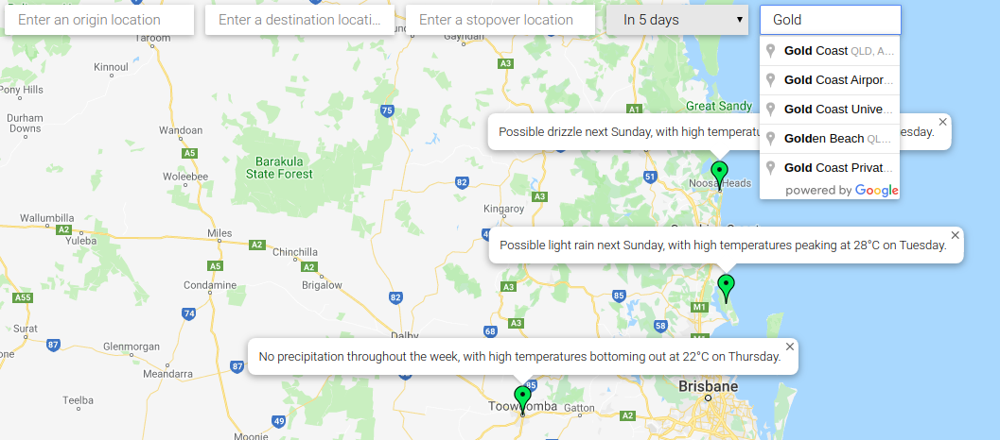
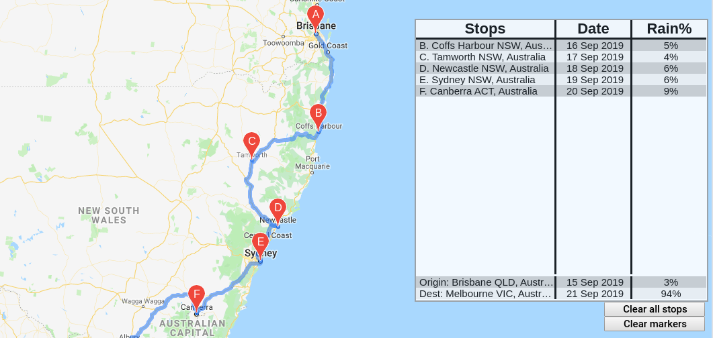
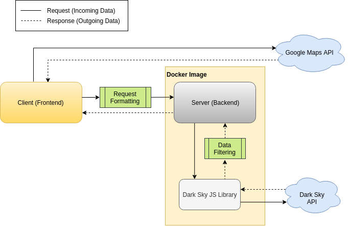

# EC2 Cloud Computing: Multi-API Mashup
This is my first web application written in JavaScript, focused on learning how to integrate multiple APIs and deploy it to AWS-like cloud system using a docker image.  

Since this is my first JS project, the code quality is likely not up to standard.   
Revision will be required as well as some patches regarding uncaught errors. 

At this point, the web app works as intended.

So what is this project about? Here's what it does:

## Want a place to relax without erratic weather?
  
Simply enter some spots you are interested in, and let the weekly summary help you decide.
## Planning a long road trip? 
  
Route your way and be informed of precipitation chance of each location at different day.
## What's happening behind the scenes?
  
This is a simple illustration of how this web app works.  
The project originally planned to have processing done largely server-sided.   
However, due to Google Maps' functionality being very client-centric, most mapping features are processed on the client side.

## Before continuing

This README is mainly a step-by-step guide for deploying an EC2 web app instance.   
The 'mashing' of these API features can be seen in the source code.

API used in this project are Google Maps API and DarkSky API.  
These keys are **deactivated** and replaced with `<YOUR_API_KEY>` in the final version of source code.  
However, feel free to replace these with your own API keys in their respective locations and try it out yourself.  

To do so, replace `<YOUR_API_KEY>` at the appropiate location:  
Replace Google Maps API key in line 62 of in `<path_to_directory>/public/index.html`.  
>_Notes: Although exposing API key isn't a good practice, Google Maps API key **must** be exposed to client as it is heavily client-sided._  

Replace DarkSky API key in line 6 of `<path_to_directory>/routes/result.js`.  
>_Notes: Contrary to Google Maps API, this key will stay hidden as it is placed in server side._  

## Local config
### Dependency setup
To re-establish dependencies, at root project directory do:
```
npm install
```  
then 
```
npm start
```  
Now open browser and go to `localhost:3000`.  
If packages were removed from package.json, do `npm prune` and package uninstallation will be handled.

### Building docker file (locally)
Dockerise using 
```
docker build -t weather-nav .
``` 
Note the of the `.` as it is **IMPORTANT**.  
Check if image has been built using `docker images`.

</br>To docker run locally, do 
```
docker run -p 80:80 weather-nav:latest
```  
The port number depends on what **ENV PORT** and **EXPOSE** were set to.

## Publishing to cloud
### Dealing with dockerhub
Make a repository on dockerhub. Here the repo is named `weather-nav`, same as the docker image file created.

Using `docker ps -a`, take note of the relative **IMAGE_NAME** from **NAMES** (last column) as we need it for our commit parameter.  
_NOTE: this is not the same as **IMAGE** name where it is `weather-nav:latest`._

Do a commit:  
```
docker commit -m "COMMIT_MESSAGE" -a "AUTHOR" IMAGE_NAME DOCKERHUB_REPO
```  
For example, in my case:  
```
docker commit -m "Initial commit" -a "Peter Chien" trange_mcnulty peter2380123/weather-nav:latest
```

</br>Now we can push with 
```
docker push DOCKERHUB_REPO
```  
This might require login. If so, do `docker login` and enter your username and password, then redo the push.

### Install docker on EC2
To set up the EC2 instance, follow the AWS tutorial on BlackBoard.  

**HOWEVER**, at the '**Configure Security Group**' page, click '**Add Rule**' and choose a **HTTP** type.  
The port should default to 80, which is what we want. 

After an EC2 instance has been setup, create new key pair and download it (`.pem`).  
Locate the `.pem` file and do:
```
chmod 400 KEY_PAIR_NAME.pem
```

Now we are ready to ssh into the AWS EC2 instance. For exmaple: 
```
ssh -i "weather-nav.pem" ubuntu@ec2-34-230-72-79.compute-1.amazonaws.com
```

Once we are in, do:
```
sudo curl -fsSL https://get.docker.com/ | sh
```  
After this the docker package is then installed on this EC2 ubuntu instance.  
Here, we could do `sudo usermod` to avoid using `sudo` every time we call `docker`, but for some reason doesn't work on EC2.  
That's fine, we will just `sudo` whenever we call docker. 

</br>Then do:
```
sudo docker login
```
and enter username and password.

</br>Then, 
```
sudo docker pull peter2380123/weather-nav
``` 
to pull from dockerhub.

</br>Check `sudo docker images` which we will use the REPOSITORY to docker run. Then run, for example:
```
sudo docker run -p 80:80 peter2380123/weather-nav:latest
```  
Now it should be running. Use Public DNS (IPv4) as public link and voila!